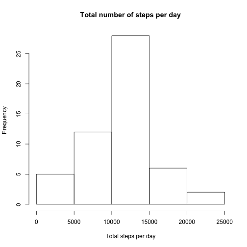
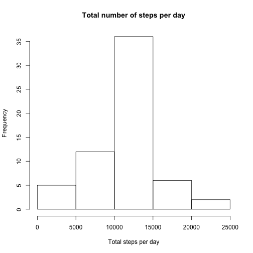

# Reproducible Research: Peer Assessment 1


Load needed libraries.

```r
require(knitr)
require(plyr)
```

```
## Loading required package: plyr
```

```r
require(dplyr)
```

```
## Loading required package: dplyr
```

```
## 
## Attaching package: 'dplyr'
```

```
## The following objects are masked from 'package:plyr':
## 
##     arrange, count, desc, failwith, id, mutate, rename, summarise,
##     summarize
```

```
## The following objects are masked from 'package:stats':
## 
##     filter, lag
```

```
## The following objects are masked from 'package:base':
## 
##     intersect, setdiff, setequal, union
```

```r
require(ggplot2)
```

```
## Loading required package: ggplot2
```

Setup `knitr` options.

```r
opts_chunk$set(echo = TRUE,message = FALSE)
```


## Loading and preprocessing the data


```r
unzip("activity.zip")
activity <- read.csv("activity.csv", header = TRUE)
activity <- mutate(activity, date = as.Date(date))
```

## What is mean total number of steps taken per day?

Find the total number of steps taken per day.

```r
stepsByDay <- activity %>%
                select(date,steps) %>%
                group_by(date) %>%
                filter(!is.na(steps)) %>%
                summarize(Total.Steps = sum(steps))
```

Plot a histogram of the total number of steps taken per day.

```r
hist(stepsByDay$Total.Steps,
     main = "Total number of steps per day",
     xlab = "Total steps per day",
     ylab = "Frequency")
```



Compute the `mean` and `median` total number of steps taken per day.

```r
meanStepsPerDay <- mean(stepsByDay$Total.Steps, na.rm = TRUE)
medianStepsPerDay <- median(stepsByDay$Total.Steps, na.rm = TRUE)
```

- The mean of total number of steps per day is 10766.19
- The median of total number of steps per day is 10765

## What is the average daily activity pattern?

Find the average number of steps taken per 5 minute interval.

```r
avgStepsPerInterval <- activity %>%
                select(interval,steps) %>%
                group_by(interval) %>%
                filter(!is.na(steps)) %>%
                summarize(Avg.Steps = mean(steps))
```

Make a time series plot of the 5-minute interval and the average number of steps taken  and averaged across all days.

```r
p <- ggplot(avgStepsPerInterval, aes(x=interval, y=Avg.Steps)) + geom_line()
p <- p + ggtitle("Average Daily Activity Pattern")
p + xlab("Interval") + ylab("Average Number of steps")
```


Find the 5-minute interval that contains the maximum number of steps on average across all the days in the dataset.

```r
maxId <- which.max(avgStepsPerInterval$Avg.Steps)
maxInterval <- avgStepsPerInterval$interval[maxId]
```

- The 5-minute interval, on average across all days, that contains the maximum number of steps is 835

## Imputing missing values

Calculate the total number of missing values in the dataset.

```r
countOfNAs <- sum(apply(is.na(activity), 1, any))
```

- The total number of missing values in the dataset is 2304

Create a function replacing the NA step by the mean of 5-minute interval averaged across all days.

```r
na.impute <- function(act) {
    ddply(act, ~interval, function(dd) {
        steps <- dd$steps
        dd$steps[is.na(steps)] <- mean(steps, na.rm = TRUE)
        return(dd)
    })
}
```

Create a new dataset that is equal to the original dataset but with the missing data filled in.

```r
imputed.activity <- na.impute(activity)
```

Find the total number of steps taken each day.

```r
imputed.stepsByDay <- imputed.activity %>%
                select(date,steps) %>%
                group_by(date) %>%
                filter(!is.na(steps)) %>%
                summarize(Total.Steps = sum(steps))
```

Make a histogram of the total number of steps taken each day.

```r
hist(imputed.stepsByDay$Total.Steps,
     main = "Total number of steps per day",
     xlab = "Total steps per day",
     ylab = "Frequency")
```



Calculate `mean` and `median` total number of steps taken per day.

```r
imputedMeanStepsPerDay <- mean(imputed.stepsByDay$Total.Steps)
imputedMedianStepsPerDay <- median(imputed.stepsByDay$Total.Steps)
```

- The mean of total number steps per day is 
10766.19
- The median of total number steps per day is 
10766.19

The imputation slightly impacted on the median total number of steps taken per day. It was changed from 10765 to 10766.19. The mean total number of steps taken per day remained the same. Usually the imputing of missing values can introduce bias in an estimates but in our case impact of it on the estimates of the total daily number of steps is negligible.

## Are there differences in activity patterns between weekdays and weekends?

Create a new factor variable `weekpart` in the dataset with two levels ???weekday??? and ???weekend???.

```r
imputed.activity <- mutate(imputed.activity,
                        weekpart = ifelse(weekdays(imputed.activity$date,abbreviate = TRUE) %in% c("Sat","Sun"),"Weekend","Weekday")
                )
imputed.activity$weekpart <- as.factor(imputed.activity$weekpart)
```

Make a panel plot containing a time series plot of the 5-minute interval and the average number of steps taken, averaged across all weekday days or weekend days.

```r
avgSteps <- imputed.activity %>%
                select(interval,weekpart,steps) %>%
                group_by(interval,weekpart) %>%
                summarise(mean=mean(steps))

p <- ggplot(avgSteps, aes(x = interval, y = mean))
p <- p + geom_line() + facet_grid(. ~ weekpart)
p <- p + ggtitle("Activity patterns on weekends and weekdays")
p + xlab("Interval") + ylab("Number of steps")
```


